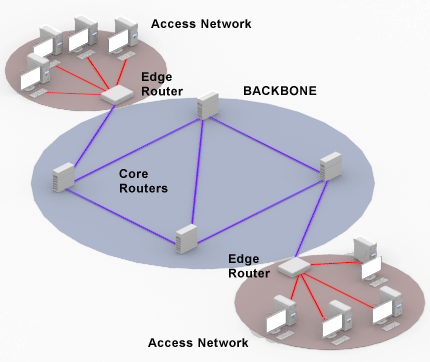
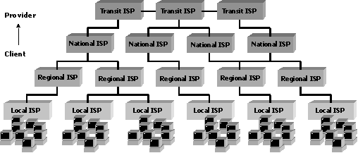
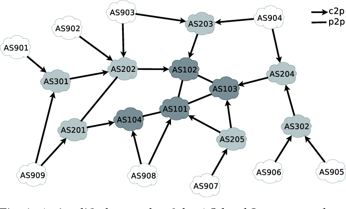
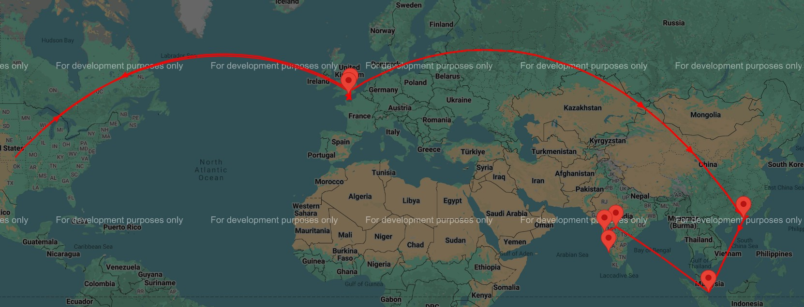

Hello everyone!

Recently I was talking to a professor at my college about some of the latest developments happening in the field of logistics. He pointed me to this concept called the Physical Internet. It is a supply chain design inspired by the Digital Internet. In short, Digital Internet is this crazy infrastructure that takes care of the logistics of digital packets/data. Folks are envisioning certain similar infra for the logistics of physical packages - that infra is still in concept phase today and is known as the Physical Internet. One can intuitively see good lot of similarities between internet and physical logistics networks. It would be interesting to see where this analogy can take us to.

That is what this series of posts will be about starting with this one. This idea of Physical Internet (PI) as being analogous to Digital Internet (DI) was formally proposed in early 2011 by Prof. Benoit Montreuil [[1]](https://numerique.banq.qc.ca/patrimoine/details/52327/2494032). While this can be a really great thought exercise by itself, it is way more than that. There are a good number of compelling reasons to explore this analogy and where it might lead to if PI is brought to reality. In Section 2 of the white paper, Prof. Montreuil makes a number of compelling reasons as to why today's logistics networks are underutilized, unsustainable and unreliable and there is a need for an intervention. Professor calls the idea of PI as a paradigm breaking vision (although it will take some time for me to convince myself of that).

Anyway, what exactly is this Physical Internet? What would it look like if it comes to reality? I think reading the white paper would be the best to get some answers to those questions. But I think one obvious pre-requisite would be to understand how Digital Internet works and how it is structured and the intricacies involved in making it function. If we get a hold on the Digital Internet design, we can make a good effort in understanding and even visualizing how Physical Internet might look like

This post, as the name suggests is about getting a good look at the Digital Internet architecture. I would like to write down how DI looks like and what happens when a data packet is generated at a source and is destined to some machine that geographically very far from the source. The analogy between PI and DI feels very obvious and intuitive and you will see that in due time. I will also write relevant info about PI (either from what the research community has produced so far or from my imagination/intuition because we have a long way to go before PI becomes a reality). One critical part that will be missing in this post is the current architecture of typical logistics network (say how DHL/FedEx/United functions and how its transportation architecture looks like). This comparison of the futuristic/imaginary PI and current architecture would have helped in understanding PI better (and why it might be a practical architecture in the coming time), but adding everything into one post would be a mess. So in this post, I will stick to the Digital Architecture and how PI might look like based on parts of the DI we will see.

Even though I had a fairly good idea about the DI architecture (owning to my bachelor's degree and professional experience at Cisco), I realized it is not enough and there are still gaps in the way I understand/visualize DI, hence this article. I will dig deep enough to pick out good analogies and stark contrasts between DI and logistics networks/PI. Adding to that, this is not a beginner-friendly post, it expects the reader to have certain knowledge in Computer Networks. To give a glimpse into reality, I will be taking examples of many Internet Service providers, products of many networking companies (primarily Cisco) and would like to show the actual hardware, actual cables that make up the Digital Internet (because I often feel the discussions around internet are superficial and abstract).

Let us get started.

## 1. DI's Physical Architecture

When we colloquially speak about DI, we say data flows through the internet, or that its a bunch of 0s and 1s transported from one place to another, or its data converted to electromagnetic waves which then travel. We will be a bit more technical and stick to the logical item/object that flows through the internet - the **Digital Packet**. The TCP/IP Networking stack[[2]](https://datatracker.ietf.org/doc/html/rfc1180) runs the DI. Internet Protocol (IP) is aptly known as the workhorse of DI. I will be going in good detail into the TCP/IP Networking stack, but later. In this section, I would stick to the overall DI architecture and how Digital Packets start at a source and reach destination (without going into the details of how these packets are processed in the TCP/IP stack and so on).

Digital Packets originate at source machines, they are transported through this huge **internetwork** and it finally reaches the destination machine. This internetwork (Or **internet** in short) is made of fundamental machines called **routers** - it is essentially an inter-network of routers.

# 1.1 The Private Network

Consider an enterprise/company at a particular physical location (say Berlin, Germany). This enterprise obviously has its own enterprise network. All the machines belonging to that company (in other words authorized by the company) and are in the physical premises of the company location are connected to this enterprise network. There are TVs, printers, scanners, projectors and all sorts of stuff connected to this enterprise network. All of these devices are connected to the network either in a wired or wireless manner. If wired (Wired-LAN), the hardware devices are connected to the nearest switch through a regular RJ45 cable (you take an RJ45 cable (both sides male) and then connect the device to RJ45 female hole typically in the wall, there is a wire running in the wall that connects to the switch) - that is what wired connections mean. If wireless (Wi-Fi/Wireless-LAN), you are connected to the network through an Access Point[[3]](https://www.cisco.com/site/us/en/products/networking/wireless/access-points/index.html) (the physical nearest Access Point to be precise, which then has a regular wired connection to the switch). The idea is that all hardware devices are connected to a switch (either directly or "logically" through a hack called Access Points). Note that all devices need not be connected to the same single switch. Suppose the company has 3 buildings and each building has 5 floors in it with each floor has say 100 devices, it is very common to see each floor having a switch with 128 ports (so 3 X 5 = 15 such switches). Checkout this webpage on switches [[4]](https://www.cisco.com/c/en/us/products/switches/switch-selector.html), you can look at how such typical switches look like. All these switches are typically connected to a "core" switch [[5]](https://www.cisco.com/c/en/us/products/switches/nexus-7000-series-switches/index.html). This is how a simple enterprise network at a particular physical location look like.

But the described network above is a "private network" and all the devices owned/authorized by the enterprises are connected to each other. But it is of hardly any use if this network is not connected to the outer world - the Internet. To make this happen, the core switch(es) of an enterprise network is connected to what is called the **gateway**. As the name suggests, it is a router that is the gateway to the outer world. Every data packet generated inside the enterprise network go to the outer world through this gateway, and every packet destined to devices inside the enterprise network first hits the gateway and it then passes on the packet into the network. The following is just one branch of the entire network:

```
                                                                               |----------------|
                                                     |-------------|           |                |
                                |--------|           |             |           |                |
|----------|                    |        |           |             |           |                |
| Laptop 1 |<--Wired/Wireless-->| Switch |<--Wired-->| Core Switch |<--Wired-->|    Gateway     |<--Wired (Optical)--> PUBLIC INTERNET
|----------|                    |        |           |             |           |                |
                                |--------|           |             |           |                |
                                                     |-------------|           |                |
                                                                               |----------------|
```

One side but important detail to note is Wired does not necessarily mean an RJ45 connection. Although there are a variety of RJ45 cables (depending on varying bandwidth/data-rates), today there are "optical" connections that are possible[[6]](https://www.cisco.com/c/en/us/products/optical-networking/product-listing.html) which can support huge bandwidths like 400 Gigabit, 1 Terabit and more.

Let us quickly see the flow of a data packet in an enterprise network. A data packet is generated by Laptop 1, it then goes to the Switch which then passes the packet to the Core Switch. Let us say the data packet is destined to some server in the public internet (say google server). The Core Switch sees this and passes the packet to the Gateway. The Gateway gracefully pushes the packet into the Public Internet. And some magic happens because of which the packet reaches the server.

# 1.2 Aggregation Stage 1

If you think about it, there are a shit ton of such private networks in this world. Some private networks can be extremely huge and sophisticated like enterprise networks (where a single company location has 10,000 employees, each employee has atleast 3 devices, a number of internal servers, other hardware devices like printers and scanners and so on) - they can be quite huge. Some private networks can be very tiny - like a home network with a coutable number of devices connected to it. The internal hierarchy of the private network depends on the complexity/size - the example we saw above was for a mid-sized enterprise network. In a very small home network, a single piece of hardware has the access point (the Wi-Fi enabler), the core switch (hardware that manages packet flows internally) and the gateway (the gateway to the Internet). The point to note is there is a gateway which "represents" each private network in the Public Internet, and there are millions of such gateways connected to the Internet.

Consider a locality/region. It has a number of home networks, enterprise networks, maybe even heavy data-centers in its physical premises. Each of these networks has a Gateway to the outer world. What is done is each of these Gateways is connected to what are called **Access Routers**[[7]](https://www.cisco.com/site/us/en/products/networking/sdwan-routers/network-convergence-system-500-series/index.html). It can be said that all the traffic from that locality is **aggregated** at one or a couple of Access Routers.

# 1.3 Aggregation Stage 2

Well, all traffic in a locality is aggregated. But that aggregation is not enough. Traffic from a number of localities are further aggregated - the traffic from a number of these access routers are **routed** to huge **Aggregation Routers**[[8]](https://www.cisco.com/c/en/us/products/routers/product-listing.html#ServiceProviderEdgeRouters). The ASR9000 series[[9]](https://www.cisco.com/site/us/en/products/networking/sdwan-routers/asr-9000-series-aggregation-services-routers/index.html) is arguably the best aggregation routers in the business. The largest model[[10]](https://www.cisco.com/c/en/us/products/collateral/routers/asr-9000-series-aggregation-services-routers/data_sheet_c78-501767.html) can handle close to 160 Tbps - that is the scale at which these aggregations happen.

# 1.4 The Core

So far, we have seen how traffic of a particular region is aggregated. It should be noted that Enterprise Gateways physically connected (typically through "optical" hardware these days) to a number of Access Routers. Based on a number of factors (which Access Router has how much load, how much load it can handle, how far/near is it and many other factors), the Gateway decides to send the traffic to the appropriate Access Router. When I say traffic, I don't mean the entire traffic that is generated by the enterprise. The decision is taken on a packet by packet case. Essentially, all the traffic generated at enterprise gateways reach the access routers. Something similar happens at this level as well. Each Access Router is physically connected to a number of Aggregation Routers and traffic is sent to one or the other aggregation routers based on different factors - all these are typically decided dynamically. And the aggregation routers have data aggregated from the region.

Each aggregation router is further physically connected to a number of **Core Routers**[[11]](https://www.cisco.com/c/en/us/products/routers/product-listing.html#ServiceProviderEdgeRouters). These Core Routers are massive in size and can handle massive amounts of data (at the order of Pbps/Petabits per second). I have personally worked with one of these platforms and these are absolute beasts when it comes to network processing. Now comes the interesting part. There is a huge inter-network of core routers which form the **backbone** of the internet. Take a look at the below diagram.



The image has jut 4 core routers for the sake of demonstration. In reality, there are tens of thousands of core routers, spread across geographies that form the backbone of the Digital Internet. It won't be wrong if I say the backbone (or the inter-network of core routers) is where true routing happens and packets travel massive geographies, moving from one core router to the next based on the routes made up by the routing algorithms.

# 1.5 End-to-End example

In section 1.1, we described as the packet leaving the Gateway and entering the Internet and magically reaching the destination. Well, we have deciphered pretty much the entire physical architecture. The packet is at the Gateway, it decides to send the packet to an appropriate Access Router (based on **dynamic routing**). From the Access Router the packet goes to, it is then routed to the appropriate Aggregation Router, then to the appropriate Core Router - at this point, the packet has officially entered the **backbone** or **core network**. The packet is routed from one core router to another based on the destination and finally lets say the packet reaches the core router closest to the destination. Continuing this example, the packet then travels to the edge - goes from Core to Aggregation, Aggregation to Access and finally Access to the exact Gateway behind which the destination is present. The Gateway then sends the packet into its private network post which the packet reaches the destination. Practically, the destination is generally these huge content servers like Google, AWS, Netflix etc., - so they talk to the Service Provider and directly connect to the appropriate Core Router (but let us not bother about that much now).

To re-iterate, the core network is a huge mesh of core routers. The data packet is routed from one router to next based on the destination.

If you are able to even partly visualize this example, it should be obvious that atleast at a conceptual level, a Physical Internet (a logistics network) can be created to **route** a physical package from source to destination. To start with, the Data Packet in the Digital Internet is analogous to the Physical Package in the Physical Internet. The private networks are these small localities and in our example, the physical package is sent from one of the homes there. The Gateway Hub is a physical hub, a small Godown where packages from that locality is collected. Then comes the Access Hub, hubs that are larger in space and faster in processing. Then comes the Aggregation Hub, which can be seen as a warehouse. Finally the Core Hub which is this massive warehouse, and there are a number of Core Hubs forming the backbone of the Physical Internet. The Physical Package, just like the Data Packet starts at the source (say I packed a birthday present for my sister who lives in another state) which is routed to different devices, one hop after another finally reaching the destination.

Atleast as a thought exercise, this analogy is interesting given the sheer number of similarities. But Prof. Montreuil talks about real reasons as to why such a paradigm shifting supply chain design is needed in today's world.

# 1.6 Hierarchy of ISPs

Until now, we discussed only in terms of devices and hierarchy of devices. But there is another way of seeing it - through the hierarchy of Internet Service Providers (ISPs). Consider the following image:


Figure 2

This hierarchy is something many of us have witnessed. There are a number of ISPs who offer end customers with home/office broadband, wired internet connections, optical fiber connections apart from the big players, and they are taking care of only a part of the entire system. In India, the big players/National ISPs today are Reliance Jio, Airtel and BSNL. There are a ton of regional and local ISPs. Many of these regional/local ISPs are whole subsidiaries of National ISPs (just some trivia).

Physical Internet may be structured in this way, although I would say it is not particularly like this today. In India, if you use DHL-Bluedart to courier a parcel from Delhi to Bengaluru, the entire end to end logistics network is managed by DHL-Bluedart. In the end, a blue dart delivery man will deliver the parcel at my home in Bengaluru. In PI, it can be different. There is lot of room for local, small players to take care of the last-mile/local/regional transportation (this too happens today, when big players are in a contract with small ones, especially to places where the big ones don't have their Hubs nearby), but this can get more prevalent under PI.

This is interesting from both operations point of view and revenue/pricing point of view. From an operations point of view, one will see a lot of collaboration among players, it will mostly probably improve last mile connectivity because big players can collaborate more with the small local logistics providers, but physical security of packages are also a concern - the package will be flowing through potentially unknown logistics providers (unlike FedEx or DHL handling the entire end-to-end logistics). Lot of interesting problems will creep in. From a revenue point of view as well, I am not sure how it is done today in the Digital Internet, that is something I want to take a look at - because services/infrastructure of a number of companies are used to deliver data, who gets what share from the 8.99EUR I pay for 15GB of data per month will be an interesting detail to know.

I want the reader to observe the number of players in the Digital Internet game, at the local and regional level. Just do a google search and you will see a shit ton of service providers. And all these are part of the hierarchy - basically, all of them come together to build the Internet. Now that I am reading about this, today's logistics networks are also made of such collabs, maybe not so tightly knit the way it is happening in DI. For example, if I want to parcel something from Bengaluru to California, I will probably use a local logistics provider and give the parcel to them. That provider say collabs with DHL for air-freight (similar to how regional ISPs collab with National ISPs for backbone/core support) and finally a logistics provider in the USA (For ex. United) delivers the parcel to my friend in California, high chance United might also have partnered with certain local logistics provider there. **TODO**: What is the level of collaboration? Need a comparison with DI as well.

Coming back to DI, this is how it is structured. It is hierarchical in nature, a few national players, a number of regional and local players. At the ends there are a number of private networks who are represented by Gateways, then a number of levels of aggregation (Access, Aggregation) and finally the backbone/core network. I left out on a couple of details on purpose, which we will be exploring now. Within he same land/geography, there is a huge network made out of these variety of routers physically placed in different locations. But how does inter-continental data travel happen? Or do these National ISPs have their own fully independent backbone networks or do they collaborate as well to make the internet work? To start with, the entire world is connected through **submarine cables** - basically under the sea internet cables around the world. Kindly read this post[[12]](https://kmcd.dev/posts/internet-map-2024/) or watch this video[[13]](https://www.youtube.com/watch?v=dZDSUY-vBgs) to get a good view into it. Coming to the second point, these large Tier-1 ISPs do collaborate, they connect to each other at these points called Internet Exchange Points (IXPs)[[14]](https://www.cloudflare.com/learning/cdn/glossary/internet-exchange-point-ixp/). These are also places where companies that essentially deliver large amounts of content (like Netflix, Amazon, Google etc.,) also attach themselves to the Internet (they don't want to be in a private network and go through all the layers, they connect right at one of the core nodes).

This is the physical architecture of the Internet.

It is not hard to visualize an analogous logistics network, is it?

## 2. Packet Routing

What we saw is the physical architecture of DI. We also got a glimpse of how a data packet travels from source to destination and the physical routes, paths it might take. What we did not see is how these routes and paths are decided for these packets? What is used to make these decisions? Where are these decisions made? As we saw, physically, the internet is this highly distributed infrastructure, the decision making, the routing decisions, is this centralized or distributed?

This section delves into how these decisions are made, and I am keen on comparing it with the current-day logistics networks and how physical packages are "routed" frm source to destination.

# 2.1 What happens in a router?

A router, as the name suggests is a computer that does the routing of packets. A router has a number of incoming and outgoing interfaces - traffic enters the router through the incoming interfaces, the router processes each and every packet, it decides on the outgoing interface the packet needs to be forwarded to and then forwards it to that particular outgoing interface and the packet leaves the router. Here, there are two things happening: The operations and decision making involved in packet routing. The operations consists of having proper incoming interfaces and the packet enters the router, it is then processed and is finally forwarded to appropriate outgoing interface. And the decision-making of which outgoing interface the packet needs to be forwarded to.

The router can be divided into two parts: The Control Plane and the Data Plane. The Control Plane is the brain of the router and does everything related to decision making. It builds what is known as the Routing Information Base (RIB), basically a table which tells which packet needs to be forwarded to which outgoing interface - the Control Plane takes care of the decision making. Then the table is loaded into the Data Plane, that takes care of the operations part. The Data Plane is this crazy hardware which can process packets at very high speeds with close to zero latency.

The equivalent to a router in PI is termed as a PI-Hub (Check section 3 in Prof. Montreuil's 2011 paper) - a physical location where physical packages come in, it is processed and sent away through the most appropriate route - that is essentially the Data Plane in the PI world. Obviously, there is a need for control plane here as well. We can't expect the working men in the Hubs to know what is the best route for a given package, someone with a conslidated, wholistic picture can compute it and let the Hubs know. So I am guessing the Control Plane team might sit in an office running algorithms to find out the best overall path for a package all the PI-Hubs in that path.

Now that we have a superficial view, let us get into some interesting specifics. I don't plan to get into the mess of working with MAC Addresses, IP Addresses and so on. I would like to discuss the idea and algorithms behind these **routing protocols**.

# 2.2 What is an Autonomous System?

From a physical architecture perspective, Internet is simply a huge inter-network of routers and similar devices. But at a logical level, it is much more interesting and sophisticated. It can be said that the internet is a huge collective of **Autonomous Systems**. An autonomous system (AS) is a fairly large network which has a single **routing policy**. In general, each AS is owned by one organization - it could be the Internet Service Providers, companies, universities and so on. Each of these Autonomous Systems has a unique identity number called the AS Number (ASN). Checkout this[[15]](https://2ip.io/analytics/asn-list/) huge list of ASNs - the internet is essentially a network of all these networks (an autonomous system is simply a network at the end of the day). This[[16]](https://www.cloudflare.com/learning/network-layer/what-is-an-autonomous-system/) cloudflare article is a good read, it gives a simple introduction to what an AS is. Here is the paragraph that sums it up.

> Imagine an AS as being like a town's post office. Mail goes from post office to post office until it reaches the right town, and that town's post office will then deliver the mail within that town. Similarly, data packets cross the Internet by hopping from AS to AS until they reach the AS that contains their destination Internet Protocol (IP) address. Routers within that AS send the packet to the IP address.



Our previous view was that the data packets travel through a number of routers from source to destination. While that statement still holds good, it can also be said that a packet starts at an autonomous system (to which the source machine belongs to), it travels through a number of autonomous systems and finally reaches the autonomous system that has the destination machine. Each of these autonomous systems is owned and managed by various organizations - there is an element of autonomy inside an autonomous system (hence the name) and an element of collaboration among orgs where these ASs are inter-connected. From routing point of view, each of these ASs can have their own routing policy (their own routing protocols) but there are standard protocols which **glue** all these ASs together, which forms the Internet.

I think this point of view is important because I see Physical Internet to work like this. There are a number of organizations/logistics network providers, each having their own logistics networks which all work in their own style (autonomy in an autonomous system), but all these logistics network providers should be connected based on certain standard terms. I think the AS-view of the Internet is more practical and anologous to logistics networks than the router-level/hub-level analogy (the router/hub level analogy is also correct, but from an organization and operations perspective, AS/logistics service provider analogy is more suitable and helpful).

# 2.3 Intra-AS Routing

Let us start with how routing happens inside an AS. An AS can have many routers that are like the edges or borders of an AS - which have connections with other ASs. And a large number of the routers are the ones inside the AS (the non-border routers) that make up the network. Suppose AS 1001 has 10 incoming interfaces and 10 outgoing interfaces (all these form the borders), and has a number of routers inside. There is a data packet at an incoming interface, the job now is to transport the packet in such a way that it reaches the most appropriate outgoing interface. The Routing Protocols used inside an autonomous system has a generic name called Interior Gateway Protocol (IGP). There are a number of IGPs out there - starting from vendor specific protocols like Cisco's IGRP (Interior Gateway ROuting Protocol), EIGRP (Enhanced IGRP) to open standard IGPs like OSPF (Open Shortest Path First), IS-IS (Intermediate System to Intermediate System), RIP (Routing Information Protocols) and all of its updated versions, OLSR (Optimized Link State Routing). There are a lot more in both of these lists.

The OSPF[[17]](https://www.rfc-editor.org/rfc/rfc2328.html) and IS-IS[[18]](https://citeseerx.ist.psu.edu/document?repid=rep1&type=pdf&doi=88795a93dbc883014d828c51f6504657e2a69ed4) are two protocols which are widely used in the backbone networks of service providers. At their heart lies the very popular Dijkstra's Shortest Path First algorithm [[19]](https://dl.ebooksworld.ir/books/Introduction.to.Algorithms.4th.Leiserson.Stein.Rivest.Cormen.MIT.Press.9780262046305.EBooksWorld.ir.pdf). I think it is better to go over Cormen's chapters on Dijkstra's than me attempting to explain the algorithm here.

# 2.4 Inter-AS Routing

We got a glimpse of how things happen inside an AS. But the Internet is a network of a large number of ASs. A packet has to essentially travel across a number of ASs to reach its destination. Each AS has the autonomy to run its own routing protocol inside it - the organization owning that AS will decide that. They can be open standard protocols, they can be proprietary. But the connections between ASs need to follow standard a standard. The protocol that glues all the ASs together is the Border Gateway Protocol (BGP)[[20]](https://datatracker.ietf.org/doc/html/rfc4271). The IETF RFC introduces BGP as,

> The Border Gateway Protocol (BGP) is an inter-Autonomous System routing protocol.

The BGP uses the Path Vector Algorithm[[21]](https://conferences.sigcomm.org/sigcomm/2003/papers/p49-sobrinho.pdf). The internet is full of videos, tutorials on the functionality of BGP. This[[22]](https://www.kentik.com/kentipedia/bgp-routing/) is a great tutorial. The idea of this sub-section here is not explain BGP to you in excruciating detail, but to get an intuitive idea of BGP, how it is the glue of the Internet, the scale of things and mainly see how/if it can help us in the routing problems in PI.

Let us start with an example. You are a blogger in India and you have a small server, on which you have hosted your blog website. Along with that, you have your own Email Server(you are a nerd who has his own email service and domain for it and does't use gmail/yahoo) and a bunch of other things. For this purpose, you have rented/leased an entire subnet of IP Addresses - 187.45.23.0/24 (This means all IP Addresses from 187.45.23.0 to 187.45.23.255 is yours to use). You have bought a bunch of domains too for your website, email server and lets say you host a small DNS server as well for your own purposes. Let the IP Address of your web-server be 187.45.23.11. You are the sold administrator of this network. What we have here is an Autonomous System. Let us say you register your Autonomous System as well and get an AS number (AS 123456).

Now, your server is physically located in Bengaluru, India. You talk to your friend in Berlin and you mention about your website and you give your website URL as well. The friend hits the URL on the browser. The browser first resolves the URL into a proper IP Address using Domain Name Service (DNS) (this would be the IP Address of the server in Bengaluru). Post resolution into an IP Address, browser sends a request data packet addressed to your server (the destination IP Address on the packet is the web-server's IP Address), asking for the landing webpage of your blog. Now, how does the packet, originating at a machine somewhere in Berlin reach your server in Bengaluru, India?

At a logical level, your friend's machine is part of an Autonomous System in Berlin (possibly owned by a local/Tier-3 ISP). The packet will probably be **punted** to an regional/Tier-2 ISP AS, then to a National/Tier-1 ISP AS (someone like Deutsche Telekom). One of these Tier-1 ISPs would own the submarine cables, the packet will be routed to Tier-1 ASs. The packet reaches a Tier-1 AS here in India, then the packet trickles down through various ASs and finally the autonomous system which contains the web-server - It can be seen as a number of AS-hops - BGP is what makes this happen - it ensures the shortest/highly efficient route is taken. The closest I could get on the internet is the following:



This is the image of AS-hops from somewhere in UK to a website in Bengaluru. I used an online version of traceroute[[23]](https://traceroute.to/) to generate it. THe long hops across continents happen because of the submarine cables. I am guessing the hop seen from UK to somewhere in USA is mostly because a hop was done to an AS managed by a USA company(?). I will be ignoring this for now and continuing. It has had a couple of AS-hops inside UK, then the packet reaches Hong Kong via the submarine cables. From there to Singapore and finally to Maharashtra, India. From here, it it has a couple of AS-hops and finally to the website/target AS. It is seen that it enters India through an AS managed by Airtel (one of India's Tier-1 ISPs), then to a BSNL AS (another Indian Tier-1 ISP) and finally to the web-server.

> 	13	182.79.224.25		9498 - BHARTI Airtel Ltd.

>	14	122.185.147.170	nsg-corporate-170.147.185.122.airtel.in	9498 - BHARTI Airtel Ltd.

>	15	Request timed out

>	16	103.225.13.126	bsnl-new-126.nitk.ac.in	9829 - National Internet Backbone

>	17	160.20.123.5	l1.nitk.ac.in

There were about 5 AS-Hops in total. Coming to the number Router-hops, there were 17, the 17th reached the web-server.

This is how internet routing happens in real time. I think the logistics networks can/should work in a similar, collaborative manner. Airtel and BSNL - both are Tier-1 ISPs and are hard competitors, but collaborate to make the internet work in India. In logistics, such collaborations are hard to come by today, especially the big players collaborating. Each of them have end-to-end logistics networks. In that case, do they even need to collaborate is a question - each of these big players have their own independent logistics networks across the same geographies, theoretically they don't need to collaborate. But what if there is high underutilization in each of their networks? When if one of them don't offer delivery services to certain location where another player is present? Be it any new concept, it is adopted by the big players only if works well for them, PI should have a feasible business model and impact on the top/bottom line for companies to adopt. I am guessing that the samll and medium-sized players in logistics will be more than happy with PI because they are being included in the network by design, but PI will work only if the big players collaborate. The big players won't adopt it just because PI is a sustainable attempt towards logistics, they will adopt if it significantly positively affects their top/bottom line. Adaptability of PI, Business Model of PI, Revenue sharing in PI are areas which definitely need our attention.

So that was BGP in action. What we saw was the operations of routing (that packet travels from one AS to another). BGP is the one making decisions. Let us see how ASs know which AS should it route the packet to (What is the next AS hop? And on what factors is it decided?)

Your subnet (187.45.23.0/24) is part of the Tier-3 ISP's AS(Call it AS 123456) (from whom you have bought your internet connection). The Tier-3 ISP shares a BGP update with the Tier-2 ISP AS (AS 10101) routers it is connected to that the subnet 187.45.23.0/24 is reachable via [AS 123456]. The Tier-2 AS (AS 10101) then shares a BGP update with all the ASs (possibly Tier-1 ISPs) that the subnet 187.45.23.0/2 is reachable via [AS 10101, AS 123456]. The Tier-1 ISP (AS 45453) stores it and shares it with other Tier-1 ISPs across the world. A Tier-1 ISP in Germany/Berlin comes to know about 187.45.23.0/24 and its reachability via [AS 45453, AS 10101, AS 123456]. Note that every border router in the ASs has a BGP table with a number of paths. The Tier-1 ISPs can have large BGP Tables with tens of thousands of routes. The Edge Aggregation Routers (like Cisco's ASR 9000) or Core/Backbone Routers (like Cisco's NCS5000 series) which are borders, which are peers in Internet Exchange (IX) points have tables with hundreds of thousands of BGP entries. These routers have a total RAM of 64/128GB or more and would have the BGP Table (can be a number of Gigabytes) entirely in RAM.

The request packet originating from your friend's machine in Berlin hits the Tier-3 ISP AS it is connected to. The Tier-3 AS may or may not know about your subnet. It will **punt** the packet to the Tier-2/1 ISP AS it is connected to. Tier-2/1 ISPs will/should know about various subnets and how to reach them. Let us say the packet reaches a Deutsche Telekom's AS (A Tier-1 AS, AS 98989). Being a Tier-1 ISP, it should know about the subnet. It will see the BGP Table and sees that the subnet is reachable via [AS 45453, AS 10101, AS 123456]. It then routes the packet to AS 45453. Once reacing AS 45453, this Tier-1 AS in India would know that the subnet is reachable via AS 10101, so the packet is routed to AS 10101, and finally AS 123456, inside which your web-server is present. The packet hits the Gateway and it forwards the packet to the web-server. This is how one packet is routed from one machine in one tiny corner of a continent to one in another.

Now the web-server creates a response (basically the landing page of the blog site), puts it in a packet and the destination IP Address would your friend's IP Address (not really, it is a bit complicated to explain the idea of the public/private IP Addresses, NAT and so on, so for now let it be your friend's IP Address). Your friend's IP Address is part of a subnet that belongs to the AS of an ISP in Berlin. The procedure that was followed in routing the packet from Berlin to Bengaluru, the same process is followed from Bengaluru to Berlin.

This is a very crude intro to BGP. This is how it works.

## 3. DI and PI

What we saw in the previous sections are vague introductions to how packet routing happens. The architecture (physical and logical), the mechanisms, algorithms used in the process. Although the idea of PI(a distributed package logistics network) seems intuitive when we see how DI works (a distributed packet logistics network). There are a number of similarities, there are a bunch of differences as well. There are several (structural and minor) characteristics of DI which PI should NOT get inspired from. There are certain fundamental problems in DI which lurk and screw with DI even today. Then there are few characteristics of DI which are simply not applicable because DI and PI are quite different after a point. These are things I would like to discuss in this section.

# 3.1 DI's Packet and PI's Package

It is quite intuitive to see that DI's Data Packet is analogous to PI's Physical Package. The crazy infrastructure that is DI is built as a logistics network for Data Packets, while PI (or even today's regular logistics service providers) are there for Physical Packages. Despite the similarities, there are a number of differences which we should be mindful of.

1. **Data Packet can be lost, Physical Package cannot be lost**: DI by design is a best effort system. It will try its best to deliver the packet to its destination, but it does not promise anything. Ofcourse, ISPs sign SLAs with customers and they use build mechanisms, infra on top of this best-effort system to meet those SLAs. What happens when a packet is dropped? There are mechanisms using which the source machine finds out, then simply re-sends the packet. And it should be noted that many a time packets are dropped as a matter of policy. One standard way of congestion control in many routers is to simply drop any incoming packet until the current set of packets are cleared up from the queue - such is the design of the system. But one cannot imagine to lose a package even by accident, let alone purposefully through a damned policy. At best, the provider loses a customer and at worst they get badly sued.

2. **Data Packet duplication is easy, Physical package duplication is not**: Duplicating anything digital is easy, anything physical is hard by their very nature. But duplicating a customer's package is extremely hard.

3. **Security means different things for Data Packets and Physical Packages**: Consider the classical trio in data security - CIA - Confidentiality, Integrity and Availability. DI by design is very poor when it comes to security aspects. It does not have any in-built protections against attacks on CIA of data flowing through it. Most of the network security solutions are reactions of years and decades of cyberattacks. I believe the same goes with logistics/physical security. Today we have sensors, GPS trackers and good lot of technology to maintain the physical security of packages. One thing I wanted to point out is a corollary to point 2 - that packages cannot be duplicated. An online hacker can easily simply tune into the right frequency and get all the packets that flow in the air from the laptops to the Wi-Fi nearby. Or if they somehow **wire-tap**, they get access to all the packets flowing through a wire. But none of these will make the data/packets un-available for the destination - the hacker might get the packets yes, but the destination will still get the packets - happens because packets are easy to duplicate. But not the case with packages. A burglar steals a package and we have an unavailability problem. In this way, security is very different for logistics providers. We are to be extra careful when it comes to physical packages.

# 3.2 DI vs. PI: The systems

Now let us talk about DI as a system.

1. **DI is a best-effort system by design**: which by the nature of logistics we cannot afford to get inspired from. Service Level should possibly be embedded into PI's design.

2. **Routing protocols are highly dynamic in nature**: PI should definitely adapt the dynamic characteristic - that is one of the possible advantages of PI. Suppose there has been a bad disaster in a particular region, which has DHL's transportation routes. The package can be dynamically routed through a different route - that is serviced by a different logistics provider - a matter of service availability (and possibly speed).

4. **DI is highly automated in nature**: The TCP/IP Networking stack is designed such that the end-to-end transportation is highly automated in nature. The routers are setup with certain initial configurations and are left untouched for months and at times years. This is definitely the kind of robustness and automation I want physical logistics to achieve. This is something Prof. Montreuil and many after him speak about - that the use of standard protocols in DI makes it highly automatable.

5. **DI is poor when it comes to congestion control**: When the protocols for Internet was built, congestion in the internet is something no one kept in mind. Then came a bunch of patchy congestion control remedies. Unfortunately, many a time congestion control remedies are useless or become detrimental to the performance of the system. PI's routing algorithms should make congestion an integral part of its design. In DI, packets are simply dropped if congestion increases in a router. But that is not possible in the case of PI. A warehouse/hub should simply say it cannot process any more packages at that point (we might not have exact numbers, we might need forecasting models for this) - this affects service availability, a key metric in logistics.

6. **Control Plane and Data Plane**: Routers have a clear distinction between Control Plane, that makes the decisions and Data Plane that implements the decison/carries on the operations. This divide is a same divide and I believe they exist in today's logistics networks as well. The Control Plane gives the routes and so on and the tactical operations teams take care of day to day operations. The Data Plane consists of the physical hubs, warehouses, godowns where the packages are processed and a variety of transportation routes that connect these hubs and warehouses. The Control Plane is the one that gives you the routes, keeps communication among hubs and warehouses and so on - this will ideally be part of the software that behaves as the Control Plane.

7. **The idea of autonomous system**: This is definitely a concept that PI needs to adapt. Viewing PI as a inter-network of hubs and warehouses will help to a certain extent, but modelling it in terms of autonomous systems is closer to reality. In reality, there are a number logistics service providers - very small to inter-continental in scale. Considering each of them as ASs is a good model. It is good to let the logistics providers operate in their own style (akin to each AS having its own routing policy) and PI needs to provide a standardized glue to connect all these providers. So coming up with a standard like BGP for PI is helpful. One interesting problem that comes to my mind is - similar to how border routers are placed and connected strategically to other border routers/data sources, where should border hubs/warehouses be physically located - Inter-AS routing needs a closer reading which can help us design PI better.

8. **A note on Routing**: In today's logistics networks, the routes are the solutions of certain complicated variants of the classical vehicle routing problem. The solution is static in nature. One big advantage of this is that you know if it is even feasible to deliver a certain package from location A to B (feasibility given certain constraints). Secondly, you know beforehand the exact route which needs to be taken. In DI, it is quite opposite. The solution (the path taken to deliver a packet from A to B) is quite dynamic, it can change every time and unfortunately one cannot give a formal guarantee that it will be delivered - because of its best-effort nature. But the advantage is it takes certain real-time conditions into considerations while routing (hence called dynamic) which improves the availability of routing service. So I would say the same problem is approached in two very different ways. I think it would be interesting to explore a hybrid of these two methods.

9. **Hierarchical nature of DI**: As much as we want to idealize DI and call it a highly distributed system, while it is one, there is a clear hierarchy set that makes the system work. As we saw, the Tier-1 ISPs at the top, followed by Tier-2 and Tier-3 ISPs. I am afraid PI will end up like DI, and I personally see no problem in it. We need big logistics networks who can put lot of capital and do the heavy lifting (and they will be rewarded accordingly). One big advantage of this system is this hierarchy and co-operative model makes DI available to many people. A local ISP can provide connections to certain locality/region and come into a contract with bigger ISPs for service. I expect something similar happening in PI. Small logistics service providers in remote locations can come into contract with regional/big players that improves availability of service. And as discussed before, in my mind PI will work only if the big players take it up - so adaptability of PI, business model of PI, revenue sharing in PI are areas we as PI researchers should definitely look into - we need to build models which will convince the big players to adapt PI.

10. **Capacity problem**: In the first section, we saw how internet devices are sized very small which can handle tiny traffics to insanely large aggregate or core routers which can handle petabytes of data every second. The exact problem will be seen here too - the capacity problem. Scaling up/down the capacities of routers is infact very easy. Modern routers are highly modular in nature. Suppose Airtel ties up with a number of local ISPs and you now know that your aggregate routers in those regions are bound to get more traffic. How do you handle it? You simply add more data-plane hardware modules (which are called Line-Cards), and you program them in the Control Plane - that is all it takes to scale-up your router. Suppose for some reason you see that traffic has reduced by half, you can simply remove unwanted Line-Cards - that way you will be saving energy on one side and you may use those Line-Cards where demand is high. Imagine similar situations in PI. Even here, we will have small PI-Hubs, PI-Godowns, large PI-warehouses and so on - there will be a size hierarchy. But the flexibility that is present in DI is missing. Either your warehouse is underutilized, or it is not enough for operations. Either ways, not easy to scale-up/down. One method used to scale-up is to rent more warehouses/hubs whenever necessary and rent the part of warehouse when underutilized.

11. **Another note on security**: In regular logistics networks, the package is in the hands of a known entity. If I pay DHL to deliver the parcel, the package will be in the hands of DHL or one of its trusted business partners. But Internet is not like that. I have taken the internet connection from some small local ISP. That packet travel through routers belonging to a number of other entities whom neither me nor the local ISP have control over. The packet travels through machines owned and run my unknown organizations. I am personally comfortable with this because in today's internet, the data is encrypted with standard encryption (AES-256 bit), and if its high fidelity data, it can be encrypted through post-quantum cryptographic algorithms too (encryption that is hard to crack even by quantum computers, it is already in production today and is used by a number of governments and private entities). There are security mechanisms which force the packet to flow through only "trusted" routers and ASs - this is something I personally worked on as well. Something similar might happen in PI - unknown logistics service providers might come into the picture and doing the last-mile deliveries, or being the middle-men in certain regions and so on. This issue of trust and security is something we need to take care of. Well, at first it might feel like free-market capitalism will take care of it ("why will they fiddle with packages, that will screw with their business!!), but we are well beyond that stage where we need to employ proper IT solutions to ensure integrity of the packages. Even here, the big players first need to be convinced that proper communication and protocol is in place that they can let their packages get into the hands of unknown logistics providers and to be able to trust them - this is another aspect to look into.

## 4. Conclusion and Future work

This is a vague article on how the Digital Internet works, and what characteristics of DI can be taken to make the idea of PI a reality - and it is a superficial attempt to do so. I wanted to get a macro-view of DI (which is why I looked at the idea of AS-Hops instead of how packets are processed in a router) and see how would PI look from far. I personally think I got a couple of points to ponder upon. I had come across a few of the points I wrote in one or the other paper/article/video on PI, but I think there are a few which I haven't come across yet.

The points in sub-section 3.2 should tell you what particularly interests me. I would like to focus on the functionality aspects of PI first and then go to the revenue and business model aspects of it. So focus would be on basic structure of PI, sorting out transportation and routing in PI, then thinking about standardized vendor associations in PI, then comes a bunch of capacity & forecasting problems, hub management. Later comes several interesting problems of revenue/business model/adaptability of PI, and ofcourse a number of other problems I have not listed here or I have no idea about.

I find it poetic that an article on a subject like PI is my first technical post as a management student. The transition from the engineer in me to management student in me could not have been smoother.

So in the articles to come, I will attempt to write more about transportation problems in logistics, routing protocols, and related work happening in PI.

Thanks for reading.

Cheers,   
Adwaith

## References

1. Prof. Benoit Montreuil's white paper on Physical Internet (Jan 2011): https://numerique.banq.qc.ca/patrimoine/details/52327/2494032  
2. A TCP/IP Tutorial, RFC 1180: https://datatracker.ietf.org/doc/html/rfc1180  
3. Cisco's Access Points: https://www.cisco.com/site/us/en/products/networking/wireless/access-points/index.html  
4. Cisco's Switch Selector page: https://www.cisco.com/c/en/us/products/switches/switch-selector.html   
5. Cisco's Nexus Switch: https://www.cisco.com/c/en/us/products/switches/nexus-7000-series-switches/index.html   
6. Cisco's Optical product portfolio: https://www.cisco.com/c/en/us/products/optical-networking/product-listing.html  
7. Cisco's NCS 500 series: https://www.cisco.com/site/us/en/products/networking/sdwan-routers/network-convergence-system-500-series/index.html   
8. Cisco's Edge Aggregation product portfolio: https://www.cisco.com/c/en/us/products/routers/product-listing.html#ServiceProviderEdgeRouters  
9. Cisco's ASR9000 series: https://www.cisco.com/site/us/en/products/networking/sdwan-routers/asr-9000-series-aggregation-services-routers/index.html   
10. Cisco's ASR9922 offering: https://www.cisco.com/c/en/us/products/collateral/routers/asr-9000-series-aggregation-services-routers/data_sheet_c78-501767.html   
11. Cisco's Service Provider Core Routers portfolio: https://www.cisco.com/c/en/us/products/routers/product-listing.html#ServiceProviderEdgeRouters  
12. kmcd.dev's post on Visualizing the Internet 2024: https://www.youtube.com/watch?v=dZDSUY-vBgs   
13. sudorandom's youtube video on Internet Map (2010-2024): https://www.youtube.com/watch?v=dZDSUY-vBgs   
14. CloudFlare article on IXPs: https://www.cloudflare.com/learning/cdn/glossary/internet-exchange-point-ixp/  
15. ASN List: https://2ip.io/analytics/asn-list/    
16. CloudFlare article - "What is an autonomous system?": https://www.cloudflare.com/learning/network-layer/what-is-an-autonomous-system/   
17. OSPFv2, RFC 2328: https://www.rfc-editor.org/rfc/rfc2328.html  
18. IS-IS Standard Document: https://citeseerx.ist.psu.edu/document?repid=rep1&type=pdf&doi=88795a93dbc883014d828c51f6504657e2a69ed4  
19. BGP's RFC4271: https://datatracker.ietf.org/doc/html/rfc4280   
21. Network Routing and Path Vector Protocols: Theory and Applications: https://conferences.sigcomm.org/sigcomm/2003/papers/p49-sobrinho.pdf   
22. BGP Tutorial: https://www.kentik.com/kentipedia/bgp-routing/    
23. Online traceroute: https://traceroute.to/   
